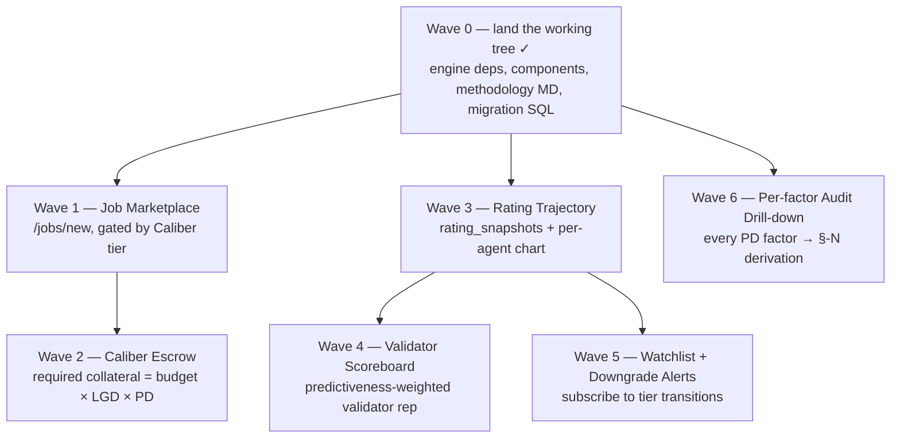

# Caliber — Build Plan (Product Depth + Methodology Rigor)

> **This is the authoritative roadmap.** Supersedes the prior phase-based
> `docs/01-mysel-roadmap.md` (deleted 2026-05-21). Phase 0 there is fully
> shipped; everything forward is the wave structure below.

## Status snapshot — 2026-05-21

| Wave | Goal | Status |
|---|---|---|
| **W0** | Land in-flight working tree (engine, service, components, migration) | **✓ Shipped** — commit `915c6f2` |
| **W1** | Job Marketplace at `/jobs/new`, tier-gated | **✓ Shipped** — form + draft API + insufficient-confidence guard + tier-gap pre-check + `/jobs` "Gated by Caliber" filter + per-row gate badge + ineligible audit signal |
| **W2** | Caliber Escrow (bond = budget × LGD × PD) | Not started |
| **W3** | Rating Trajectory (daily snapshots + chart) | Not started |
| **W4** | Validator Scoreboard (predictiveness-weighted) | Not started — blocks on W3 |
| **W5** | Watchlist + Downgrade Alerts | Not started — blocks on W3 |
| **W6** | Per-factor Audit Drill-down | Not started — independent of W2-W5 |

### Hard corrections vs the originating plan

These three points were flagged during the codebase validation pass and
override the original plan text where it conflicts:

1. **Methodology version stays `1.0.0`**, not `1.0.1`. Coefficient tuning is
   logged in Methodology Appendix F as a tuning event but does **not** bump
   the version. A version bump is reserved for formula/factor-list changes
   per the governance rule (§8). The plan's instruction to set
   `METHODOLOGY_VERSION = '1.0.1'` should be ignored.
2. **`min_tier` and `min_confidence` columns are `smallint`** in
   `packages/db/src/schema.ts`, not text enums. The plan assumes strings.
   Resolution: encode/decode at the API boundary (one helper per column),
   do **not** migrate the columns. Forms and gateway calls should pass the
   numeric encoding the contract expects.
3. **Wave 0 and most of Wave 1 are already shipped.** All Wave-0 files exist
   on disk and pass `pnpm typecheck`. Wave 1 finishes with two polish items
   only (see the W1 scope-remaining section below).

---

## Context

The working tree (now committed at `915c6f2` on
`restructure/rating-service-prep`) already contains a Caliber rebrand, a
tuned PD/LGD/EAD engine (v1.0.1 tuning — recalibrated against 883 real
agents on 2026-05-21), a bulk/distribution rating API consumed by the
homepage, EIP-712 signing scaffolding, a `job_drafts` table with `min_tier` /
`min_confidence` gating columns, and ConnectKit wallet wiring threaded into
the job-detail page. The on-chain pieces — `RatingVerifier`
(`0xbc5942F89AFDf3d62b5c73B946258A0Dcb1Aa6cb`) and `RatingGateway`
(`0x87230cfa52DbfBC4a81167F1dFa9eDA04B754837`) — are already deployed on Arc
testnet under EIP-712 name=Caliber.

What's missing isn't more "basics" — the rating itself is in production. The
real leverage now is **second-order primitives that prove the rating is
useful**: a marketplace that consumes it, an escrow that prices it as
collateral, and the methodology-rigor pieces (trajectory, validator
calibration, per-factor audit) that make the rating credible enough for
other protocols to integrate.

The plan is two-track: a Wave 0 cleanup (✓ done) that landed the in-flight
working tree end-to-end, then six product/rigor waves stacked in dependency
order. Each wave is sized so it can ship in a focused session, ends in a
verifiable artifact, and ships with a builder-voice tweet.

## Shape of the work



Two pipelines: the **product** pipeline (W1 → W2) turns a Caliber tier into
gated capital. The **rigor** pipeline (W3 → W4 / W5) makes ratings durable
and auditable. W6 is independent and can land anywhere after W0.

---

## Wave 0 — Land the working tree ✓ shipped

Captured here for posterity. Landed in commit `915c6f2` on 2026-05-21.

**Engine deps** (`rating/engine/`) — all present:
- `features.ts` — `buildFeatures(agentId, chainId, lookbackDays)` queries
  `agents`, `feedbackEvents`, `validations`, `jobs`, builds per-validator
  aggregate. Derives `registeredAt` from earliest event when DB column is NULL.
- `segment.ts` — `classifySegment(agentType, capabilities, validatorValidationCount)`
  returns `'payment-relay' | 'trading' | 'service' | 'validator'`.
- `version.ts` — `METHODOLOGY_VERSION = '1.0.0'` (NOT `1.0.1` — see hard
  corrections above).
- `types.ts` — `AgentFeatures`, `AgentSegment`, `CaliberTier`,
  `ConfidenceTier`, `RatingView`, `RatingResult`, `RatingResponse`,
  `UnratedResponse`, `RatingFactors`.

**Rating service runtime** — `rating/src/{server,rating,attest,bulk,distribution}.ts`.
Express 5 on port 3100. Routes: `/v1/ratings/bulk`,
`/v1/ratings/distribution`, `/v1/agents/:chain/:id/rating`,
`/v1/agents/:chain/:id/attest`. Domain: `name=Caliber, version=1,
chainId=5042002, verifyingContract=RATING_VERIFIER_ADDRESS`.

**Web components** — all present:
- `web/src/components/ui/RatingBadge.tsx`, `web/src/components/home/LiveTicker.tsx`,
  `web/src/lib/wagmi/Web3Provider.tsx`, `web/src/app/jobs/[id]/_components/{OnChainJobState,JobActions}.tsx`.

**Docs / migrations / smoke** — all present:
- `docs/02-riskmodel/01-Methodology.md` (609 lines, fully §-numbered)
- `packages/db/migrations/0002_brainy_thaddeus_ross.sql`
- `web/src/app/integrate/page.tsx`
- `rating/tests/{engine,integration}.test.ts`

**Tweet 0** (ship log):
> Caliber v1.0.1 is live on Arc.
>
> • 9-tier rating (Caliber-AAA → Caliber-D), PD × LGD × EAD
> • recalibrated against 883 real ERC-8004 agents
> • every response signed EIP-712, verifiable on-chain
> • RatingVerifier `0xbc59…a6cb` · methodology pinned
>
> `caliber.poko.blue`

---

## Wave 1 — Job Marketplace (tier-gated) ✓ shipped

**Status: ✓ Done.** Form + draft API + insufficient-confidence guard landed
in `915c6f2`. Tier-gap pre-check + `/jobs` "Gated by Caliber" filter +
per-row gate badge + ineligible audit signal landed in the follow-up.

### Already shipped (do not re-do)
- `web/src/app/jobs/new/page.tsx` + `_components/PostJobForm.tsx` — form
  with target agent, title, description, budget USDC, `min_tier` dropdown
  (`CaliberTier` enum), `min_confidence` (low/medium/high), deadline,
  wallet-connected gating, three-popup gateway flow.
- `web/src/app/api/jobs/draft/route.ts` — POST validates with zod, inserts
  into `job_drafts`, returns `draftHash` (keccak256).
- `web/src/app/api/jobs/[id]/route.ts` — GET/PATCH for draft → on-chain
  marriage.
- Inline guard for unrated agents (`insufficient_interactions` /
  `insufficient_history`) — already in `PostJobForm.tsx`.

### Scope remaining
- **"Gated by Caliber" filter on `/jobs` list** — add a filter chip to
  `web/src/app/jobs/page.tsx` that joins `jobs` to `job_drafts` on
  `onchain_job_id` and surfaces `min_tier`. Show the requirement on each
  row; if a job's provider was below tier at offer time, mark "ineligible
  — should not have been accepted" (an audit signal).
- **Inline tier-gap pre-check** — extend `PostJobForm.tsx` so that when the
  selected `target_agent_id` doesn't currently meet `min_tier`, render
  "blocked — agent is Caliber-BB, requires Caliber-A" before the user
  submits. Uses the existing `/v1/ratings/bulk` endpoint.

### Encoding note (per hard correction #2)
`min_tier` and `min_confidence` columns are `smallint`. The form should
encode via a tiny helper:
```ts
const TIER_ORDINAL = { 'Caliber-AAA': 0, 'Caliber-AA': 1, ..., 'Caliber-D': 8 };
const CONFIDENCE_ORDINAL = { low: 0, medium: 1, high: 2 };
```
Match the encoding the `RatingGateway` contract expects.

**Verification:**
- Post a draft requiring `Caliber-A` against an agent that is `Caliber-BBB`.
  Form rejects with the tier-gap message.
- Post a draft requiring `Caliber-BBB` against an agent that qualifies;
  wallet signs; `createJob` lands on Arc; the draft's `onchain_job_id` is
  patched; the new job appears in `/jobs` with the gate visible.

**Tweet 1**:
> tier-gated jobs are live on Caliber.
>
> post a job with `min_tier: Caliber-A` — only agents that clear the
> methodology threshold can accept. the gate is published on-chain via the
> RatingGateway, enforceable by any contract.
>
> first capital primitive built on top of a rating: done.

---

## Wave 2 — Caliber Escrow (credit-priced collateral)

Turn a tier into a capital-efficiency number. This is the actual point of a
credit rating.

**Contract** (`contracts/src/CaliberEscrow.sol`):
- `function postBond(uint256 jobId, RatingAttestation calldata att) external`
  — calls `RatingVerifier.verify(att)`, reads `att.ppd_30d` and `att.lgd`,
  requires `msg.sender` to lock
  `requiredBond = budget * lgd * ppd_30d` USDC. Stores under `(jobId)`.
- `function release(uint256 jobId) external` — only AgenticCommerce can
  call; releases bond when job hits `Completed`.
- `function slash(uint256 jobId, address to) external` — only
  AgenticCommerce on `Rejected`/`Expired`; transfers bond to client.
- View: `function requiredBond(uint256 budget, uint256 ppd, uint256 lgd)`
  for UI preview.

**Deploy + record** — Foundry script under
`contracts/script/DeployEscrow.s.sol`, then add the deployed address to
`indexer/shared/chain-config.ts` under `arc.contracts.caliberEscrow`.

**Web:**
- `web/src/app/jobs/[id]/_components/CaliberBondPanel.tsx` — shows required
  bond preview from current attestation, "Post bond" button (calls
  `postBond`), bond status thereafter.
- `web/src/app/integrate/page.tsx` — add a "Caliber as collateral" section
  quoting the bond formula and the deployed `CaliberEscrow` address.

**Math sanity (publish in the tweet):**
- AAA agent, PD=0.4%, LGD=0.15, budget 1000 USDC → bond ≈ 0.6 USDC (0.06%)
- BBB agent, PD=4%, LGD=0.3, budget 1000 → bond ≈ 12 USDC (1.2%)
- CCC agent, PD=30%, LGD=0.5, budget 1000 → bond ≈ 150 USDC (15%)
- D — blocked entirely (already enforced by tier gate, fail-closed on verify)

**Verification:**
- Local fork test: deploy CaliberEscrow, mint test USDC, post bond against a
  real attestation, simulate job complete → bond released; simulate expired
  → bond slashed.
- Live: post one demo job + bond on Arc testnet against a real
  Caliber-rated agent, link from `/integrate`.

**Tweet 2**:
> Caliber Escrow v0 on Arc.
>
> required bond = budget × LGD × PD.
>
> • Caliber-AAA on a 1000 USDC job → 0.6 USDC bond
> • Caliber-BBB → 12 USDC
> • Caliber-CCC → 150 USDC
> • Caliber-D → blocked
>
> capital-efficient by construction. higher trust = lower lockup. credit
> primitive, not just a label.

---

## Wave 3 — Rating Trajectory (snapshots + chart)

The rating is more credible when its history is durable. Also a
prerequisite for W4 (calibration) and W5 (downgrade detection).

**Schema** (`packages/db/src/schema.ts` + new migration):
```ts
export const ratingSnapshots = pgTable('rating_snapshots', {
  id: bigserial(...).primaryKey(),
  chainId: text(...).notNull(),
  agentId: bigint(...).notNull(),
  computedAt: timestamp(...).notNull(),
  tier: text(...).notNull(),
  ppd30d: numeric(...),
  lgd: numeric(...),
  ead: numeric(...),
  confidence: text(...),
  view: text(...),                  // PIT | TTC
  methodologyVersion: text(...),
}, (t) => ({
  agentDayIdx: index().on(t.agentId, t.computedAt),
  computedAtIdx: index().on(t.computedAt),
}));
```

**Cron** (`rating/scripts/snapshot-daily.ts`, systemd timer in `deploy/`):
- Once a day: enumerate all rated agents (bulk endpoint already does it),
  insert one row per agent per view (PIT + TTC where eligible). Idempotent
  on `(agent_id, date(computed_at), view)`.

**API**:
- `GET /v1/agents/:id/rating/history?days=180` — returns
  `[{date, tier, ppd_30d}, ...]`.

**Web**:
- `web/src/app/agents/[id]/page.tsx` — add a "rating trajectory" section
  rendering a `recharts` line chart (PIT solid, TTC dashed overlay where
  available). Tier on the y-axis, time on x. Vertical markers on
  methodology version changes (`v1.0` → `v1.0.1`).
- `web/src/app/stats/page.tsx` — stacked area chart of tier distribution
  over time. The story: "tier mix is stabilizing as the registry matures."

**Verification:**
- Backfill snapshots for the last 30 days using existing block-based
  timestamps (the indexer keeps history; `pd.ts` already computes against
  `lookbackDays`).
- Detail page renders a meaningful curve for a top agent (AAA→AAA→AAA) and
  a volatile agent (BBB→BB→CCC).

**Tweet 3**:
> Caliber now keeps history.
>
> every rated agent has a daily snapshot. visit any agent on caliber.poko.blue
> and you'll see their 30/90/180-day trajectory. PIT solid, TTC dashed.
>
> a rating without a backtest is a vibe. this isn't a vibe.

---

## Wave 4 — Validator Scoreboard

Validators in ERC-8004 leave feedback that drives PD. Not all of them are
equally predictive. Now that snapshots exist, calibrate them.

**Compute** (`rating/engine/validator-score.ts`):
- For each `(validator, agent)` pair, compare the validator's score
  (`feedback_events.score`) to the agent's *subsequent* tier movement /
  default outcome over the next 30 days.
- Calibration = inverse Brier or simple rank correlation; volume-weighted.
- Output: per-validator `{ predictiveness, volume, agents_covered }`.

**Materialized table** (`packages/db/src/schema.ts`):
- `validatorScores` keyed by `(chainId, validatorAddress)`; refreshed by
  the same daily cron.

**Web:**
- `web/src/app/validators/page.tsx` — leaderboard: validator, agents
  covered, total feedback, predictiveness score. Sort/filter.
- On agent detail page, the existing "validators" tab now shows
  predictiveness next to each validator address — "this validator's scores
  have been right 78% of the time."

**Verification:**
- Synthetic test: a validator who always scores 90 on agents that later
  default should rank near 0 predictiveness; one whose scores correlate
  with tier moves should rank high.

**Tweet 4**:
> not all ERC-8004 validators are equal.
>
> Caliber Validator Scoreboard ranks every validator on Arc by how well
> their scores predicted what happened next. calibration metric,
> volume-weighted, derived only from on-chain receipts.
>
> validator-level reputation, with no extra trust assumptions.

---

## Wave 5 — Watchlist + Downgrade Alerts

Make tier transitions consumable as events. Useful for any protocol using
Caliber as a runtime gate.

**Schema:**
- `watchlistSubscriptions(id, subscriber, agentId, chainId, channel, target, createdAt)`
  — `channel` ∈ `{ email, webhook }`.

**Cron** (extend the W3 daily snapshot job):
- After writing snapshots, diff tier vs yesterday. Any change → emit per
  subscription: POST webhook, or send email (`resend` API is one extra dep;
  or skip email and ship webhooks only for v0).

**Web:**
- "Watch" button on agent detail page → sign-message-based add (no
  on-chain cost).
- `web/src/app/watchlist/page.tsx` — list, remove.

**Public RSS** (optional but cheap):
- `GET /v1/feed/downgrades.xml` — RSS of all tier transitions across the
  registry. Nothing to subscribe to. Great for shareable inbox demo.

**Verification:**
- Add yourself as a webhook subscriber for a known-volatile agent. Force a
  downgrade in a staging snapshot. Confirm webhook hits.

**Tweet 5**:
> Caliber Watchlist:
>
> subscribe to any ERC-8004 agent with a webhook → get notified the moment
> their Caliber tier moves. AA → A, A → BBB, BBB → watchlist.
>
> tier transitions are now events your protocol can react to in real time.
>
> bonus: `/v1/feed/downgrades.xml` is a public RSS of every downgrade.

---

## Wave 6 — Per-factor Audit Drill-down

Make every Caliber rating fully auditable down to the methodology section
that produced it.

**API:**
- `GET /v1/agents/:id/rating/explain` — already partly available via the
  `factors` field on `RatingResult`. Promote each factor to include
  `{ value, coefficient, contribution_to_logit, methodology_ref }` (e.g.,
  `§4.4.basePdLog`).

**Web:**
- `web/src/app/agents/[id]/page.tsx` — beside the rating, render an
  "explain" panel. Each PD factor (`base_ppd`,
  `validator_diversity_index`, `job_size_cv`, etc.) is a row: factor name,
  value, coefficient, contribution. Click → popover with the §-N quote
  pulled from `docs/02-riskmodel/01-Methodology.md` (anchor link).
- Sum of contributions = `logit`. Display `1 / (1 + exp(-logit)) = PD`.

**Verification:**
- Pick one rated agent, walk the explainer top-to-bottom, confirm every
  line sums to the published `logit` and the resulting tier.

**Tweet 6**:
> every Caliber rating now drills down to the line of methodology that
> produced it.
>
> click any factor on an agent's page → see §4.4 logit, the coefficient,
> your agent's input, the contribution to PD. sum the column → recover the
> published number exactly.
>
> no black box. open methodology, open math.

---

## Notes on sequencing & risk

- **Wave 0 is non-negotiable and first.** ✓ Done.
- **W2 (Escrow) ships a new contract.** Foundry workflow, fork-test, then
  a deploy script under `contracts/script/DeployEscrow.s.sol` with the
  address added to `chain-config.ts`. Keep the contract small (one file,
  ~150 LOC) so audit surface stays trivial.
- **W3 unblocks W4 and W5.** If you skip W3, do not attempt W4/W5 — they
  need the snapshot history.
- **W6 is the cheapest credibility win.** Largely API + frontend; no new
  storage, no cron. Slot it in any slow afternoon.
- **Cross-cutting**: every wave keeps `methodology_version: '1.0.0'`
  pinned in responses (per hard correction #1). When a real recalibration
  happens that changes the formula, bump to `1.1.0` and the trajectory
  chart will auto-mark the version boundary.

## Tweet thread cadence

One tweet per wave at ship time. They form a builder log without spoiling
each other: W0 establishes the rating, W1/W2 turn it into capital,
W3/W4/W5 turn it into history + events, W6 makes it transparent. Pin Wave
1 or Wave 2 once it's live — the marketplace/escrow demo is the most
retweetable.

---

## Relationship to other planning docs

- `docs/02-riskmodel/01-Methodology.md` — the methodology paper (CC BY 4.0,
  served at `caliber.poko.blue/methodology`). Source of §-N anchors W6 will
  link into.
- `docs/02-riskmodel/02-Roadmap.md`, `phase1.md`, `phase1-daily-plan.md` —
  prior phase-based execution notes. **Superseded** by this file for
  scheduling. Methodology-internal §s in `02-Roadmap.md` may still inform
  W3-W6 design.
- `~/.claude/plans/eager-plotting-horizon.md` — the Phase-1 Circle grant
  submission plan (~10 days of work, deadline 2026-05-31). Runs in
  parallel with this roadmap; treat it as an out-of-band funding
  workstream, not a build wave.
